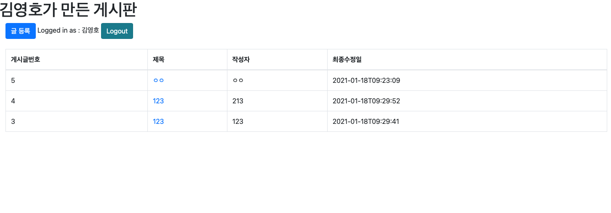
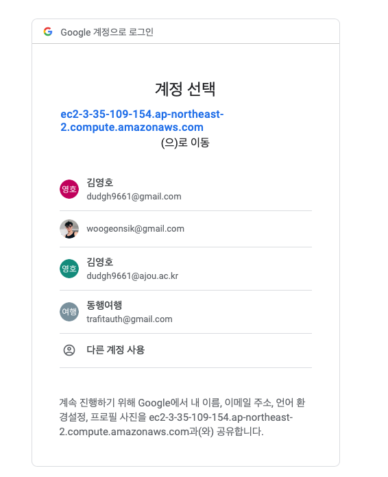
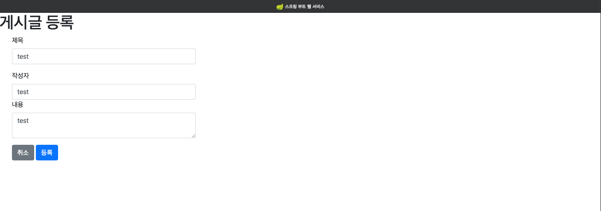
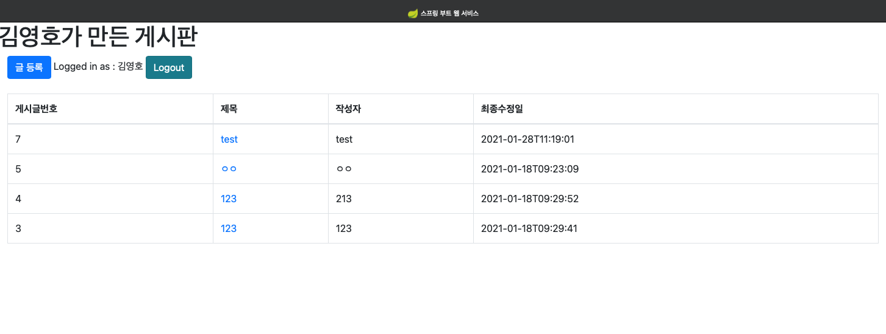

# Spring Boot Framework를 이용한 무중단 배포 게시판 웹 페이지

1번째 (0, 0) //cur, curDis

2번째 (2, 1)

3번째 (3, 2)

4번째 (3, 100) <== 이 때를 위한 코드이다. 즉, 같은 정점이 여러번 뽑힐 수가 있고 2번째 뽑힌 정점(3,100)은 이미 정점이 첫번째로 뽑힌 시점(3,2)보다 꾸진 시점이라 주변 간선을 다시 보는 행위가 필요없기 때문이다.
